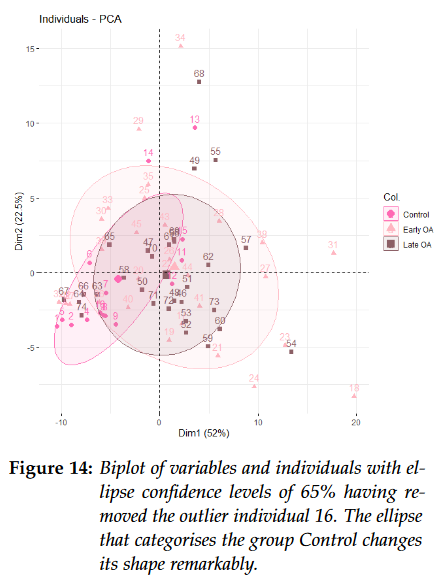

<div align="center">



</div>

<h1 align="center" style="margin-top: 0px;"><b>Principal Component Analysis</b> - A Useful Method for Osteoarthritis Diagnose</h1>
<h2 align="center" style="margin-top: 0px;">Betriebssysteme und Rechnernetzwerke</h2>

# Introduction

This project was developed voluntarily during the summer semester 2023 and aims to prove the power of PCA in medical diagnose. The original code is not public yet under college policies, however the main algorithm can be found in the .pdf file on the repository. 

[Download the PDF document](./23ss_carsigonzalez_PCA.pdf)

# Requirements

## Hardware
## Software
-  R >= 4.2
-  RStudio

# Getting Started
## Clone The Repository

```sh
git clone https://github.com/anacarsi/23ss-PCAOsteoarthritis.git
cd 23ss-PCAOsteoarthritis 
```

## Create A Virtual Environment (optional):

### With conda

```sh
conda create -n pcaoa
conda activate pcaoa
```

## Install

### Install the package

```sh
pip install -e .
```

# Citation
```bibtex
@software{
    author = {Ana Carsi},
    title = {Principal Component Analysis: A Useful Method for Osteoarthritis Diagnose},
    month = mar,
    year = 2023,
    publisher = {GitHub},
    version = {0.1.0},
    url = {https://github.com/anacarsi/23ss-PCAOsteoarthritis}

}
```
